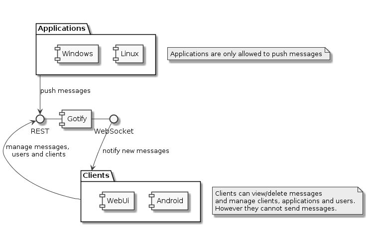

This is the documentation of gotify/server. Lets start with some definitions:

A client is a device or application that can manage clients, messages and applications.
However a client is not allowed to send messages.

An application is a device or application that only can send messages.

A message has the following attributes: content, title, creation date, application id and priority.

